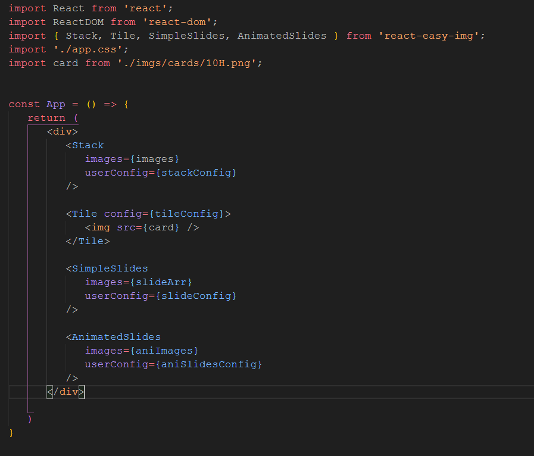
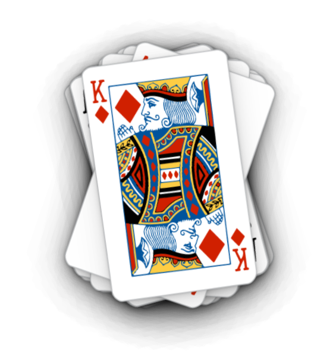
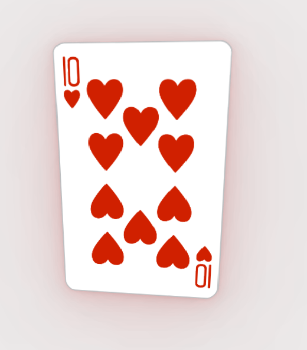
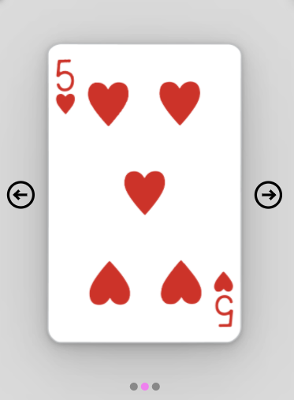
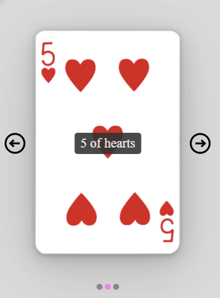
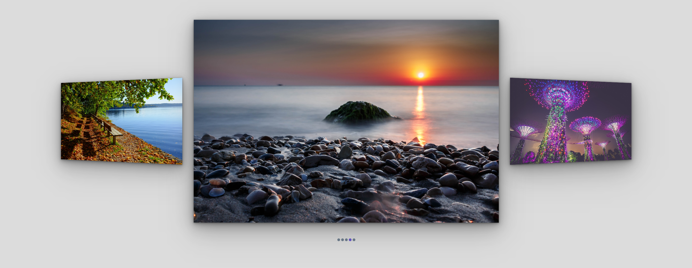
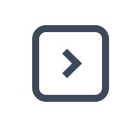

# React Easy Img

  
&nbsp;&nbsp; React Easy Img is a React componenet library to assist in creating interactive/responsive good looking images for your webpage.

As of version 1.0.2 React Easy Img has 4 components to choose from with more to be added in the near future. Those components are:


&nbsp; 1. [Stack](#stack)

&nbsp; 2. [Tile](#tile)

&nbsp; 3. [SimpleSlides](#simpleslides )

&nbsp; 4. [AnimatedSlides](#animtedslides )

All components must be passed a **userConfig** prop which must be an object with some required values and other optional ones. Each component's configs are broken down in their relevant documentation.
  

# Installation and Setup

  
&nbsp; React Easy image can be installed via NPM with the following command. <br/>

&nbsp;&nbsp; `npm install react-easy-img` <br/>

&nbsp; Once installed import the R-E-I component you would to use "Stack, Tile, AnimatedSlides, SimpleSlides" into your desired React component. <br/>

&nbsp;&nbsp; `import {name of component} from 'react-easy-img'` <br/>

&nbsp; please see the relevant information on how to correctly utilise R-E-I components.

<ins>__Example:__</ins> <br/>
  

# Stack #

The **Stack** Component must be passed 2 properties:

&nbsp;&nbsp;&nbsp; 1. *images* <br/>
&nbsp;&nbsp;&nbsp; 2. *userConfig*

&nbsp;`<Stack images={stackImages} userConfig={yourConfigSettings} />`
### <ins> Images</ins>
&nbsp;&nbsp; Images must be an array of required images via webpack
```
const  importAll = (r) => {
	return  r.keys().map(r);
};

let stackImages = importAll(
	require.context("path-to-imgs-folder", true, /\.(png|jpe?g|svg)$/)
);
```
or
```
const stackImages  = [
	require('./imgs/stackImgs/image1.jpg'),
	require('./imgs/stackImgs/image2.jpg'),
	require('./imgs/stackImgs/image3.jpg'),
	require('./imgs/stackImgs/image4.jpg'),
	require('./imgs/stackImgs/image5.jpg')
];
```
###  <ins>Config </ins>
  
  Stack's config options are as follows: 

| Key         | Type |    Property is required | Default Values |
| :---        |    :----:   |  :----:|    :---|
| imgWidth      	| string       |   __yes__    | N/A|
| imgHeight   		| string        |     __yes__  |	N/A|
| containerHeight   		| string        |     no  |	imgWidth + 150px|
| containerWidth   		| string        |     no  |	imgHeight + 150px|
| border| string        |     no  | "none"|
| allowDots|boolean|no|true|
| dotHighlightColor| string        |     no  | ""violet |
| dotBgColor|    string|     no  |	"#777" |
| allowChevrons |boolean|no|false|
| [chevronStyle](#chevron-styles)|number|no|1|
| chevronHoverColor|string|no|"black"|
| chevronColor|string|no|"black"|

if no conatinerHeight and containerWidth values are passed they will be calclated with the imgWidth and imgHeight + 150px

__Eample__:
```
const  stackConfig  = {
	imgWidth:  "250px",
	imgHeight:  "400px",
	containerWidth:  "470px",
	containerHeight:  "600px",
	dotBgColor:  "#888",
	dotHighlightColor:  "violet",
	shadowColor:  "rgba(100, 100, 100, 0.05)",
	allowDots:  false,
	allowChevrons:  false
}
```



By default clicking on the top image will cycle through the images. Clicking on the final image will reset the stack. [Chevrons](#Chevrons) can enabled with the **allowChevrons** config property being set to true. 

[try on codepen](www.codepen.io) 

# Tile #

For the Tile component it is imperative you only wrap a single element that element can have child elements within its container but the tile effects will only work on a single outer element <br/>

E.G <br/>

```
<Tile userConfig={yourConfigSettings}>
    
</Tile>
```
Tile's config must be passed with **width** and **height** values passed as a string. These values can be any CSS value E.G. *"PX, EM, REM, CM, MM, %, etc"*

Tile's config options are as follows: 

| Key         | Type |    Property is required | Defaults |
| :---        |    :----:   |  :----:|    :---|
| width      	| string       |   __yes__    | N/A|
| height| string        |     __yes__  |	N/A|
| shadowColor   | string        |     no  | "rgba(0,0,0, 0.7)"|
| maxShadowBlur   | number        |     no  | 64 |
| scale   |    number     |     no  |	1.1 |
| traction|number|no|17|




[try on codepen](www.codepen.io) 

  

# SimpleSlides #

After importing **react easy img** render the **SimpleSlides** component in your JSX 
the **SimpleSlides** Component must be passed 2 properties:

&nbsp;&nbsp;&nbsp; 1. *images*
&nbsp;&nbsp;&nbsp; 2. *userConfig*

&nbsp; ```<SimpleSlides images={yourImagesArray} userConfig={yourSimpleSlidesConfig} />```

### <ins>Images</ins>
Due to having the option to have captions for these images the import method must differ slightly to that of *Stack* The images passed as a prop to **SimpleSlides** must be an **Array of objects** with the following key value pairs:
```
const  simpleslidesArray  = [
	{ img:  require("path-to-your-img.png"), cap:  "2 of clubs" },
	{ img:  require("path-to-your-img.png"), cap:  "5 of hearts" },
	{ img:  require('path-to-your-img.png'), cap:  "3 of dimaonds" },
	{ img:  require("path-to-your-img.png"), cap: ""}
];
```
If no caption is required just pass an empty string.

###  <ins>Config</ins>

Simple Slides config must be passed with **imgWidth**, **imgHeight**, **containerWidth** and **containerHeight** values passed as strings. These values can be any CSS value E.G. *"PX, EM, REM, CM, MM, %, etc"*

Simple Slides config options are as follows: 

| Key         | Type |    Property is required | Defaults |
| :---        |    :----:   |  :----:|    :---|
| imgWidth      	| string       |   __yes__    | N/A|
| imgHeight   		| string        |     __yes__  |	N/A|
| containerWidth| string|     __yes__| N/A|
| containerHeight| string|     __yes__| N/A |
| maxShadowBlur|    number     |     no  |	64|
| shadowColor|string|no|"rgba(0,0,0, 0.07)"|
| capFontSize| string|     no| "14px" |
| capColor|    string|     no  |	"whitesmoke"|
| capBgColor|string|no|"rgba(0,0,0, 0.87)"|
| [chevronStyle](#chevron-styles)|number|no|1|
| chevronScale|number|no|1|
| chevronHoverColor|string|no|"black"|
| chevronColor|string|no|"black"|
| allowDots|boolean|no|true|
| dotHighlightColor|string|no|"violet"|
| dotBgColor|string|no|"#888"|

__Eample__:
```
const  tileConfig  = {
	width:  "250px",
	height:  "400px",
	shadowColor:  "rgba(150, 0, 0, 0.08)",
	maxShadowBlur:  120,
	traction:  17,
	scale:  1.1
}
```


 

[try on codepen](www.codepen.io) 


# AnimtedSlides #


After importing **react easy img** render the **AnimatedSlides** component in your JSX 
the **AnimatedSlides** Component must be passed 2 properties:

&nbsp;&nbsp;&nbsp; 1. *images*
&nbsp;&nbsp;&nbsp; 2. *userConfig*

&nbsp; ```<AnimatedSlides images={yourImagesArray} userConfig={yourSimpleSlidesConfig4} />```

### <ins>Images</ins>
Due to having the option to have captions for these images the import method must differ slightly to that of *Stack* The images passed as a prop to **SimpleSlides** must be an **Array of objects** with the following key value pairs:
```
const  simpleslidesArray  = [
	{ img:  require("path-to-your-img.png"), cap:  "2 of clubs" },
	{ img:  require("path-to-your-img.png"), cap:  "5 of hearts" },
	{ img:  require('path-to-your-img.png'), cap:  "3 of dimaonds" },
	{ img:  require("path-to-your-img.png"), cap: ""}
];
```
If no caption is required just pass an empty string.


### <ins>Config</ins>

AnimatedSlide's config options are as follow:

| Key         | Type |    Property is required | Defaults |
| :---        |    :----:   |  :----:|    :---|
| imgWidth      	| string       |   __yes__    | N/A|
| imgHeight   		| string        |     __yes__  |	N/A|
| allowDots|    boolean|     no  | true|
| dotHighlightColor|string|no|"violet"|
| dotBgColor| string|     no| "#777" |
| maxShadowBlur|    number|     no  |64|
| shadowColor|string|no|"rgba(0,0,0, 0.19)"|
| roateTime|number|no|350 *(in ms)*|

__Example:__
```
const  aniSlidesConfig  = {
	containerWidth:  "100%",
	containerHeight:  "1000px",
	imgWidth:  "2000ppx",
	imgHeight:  "1250px",
	dotBgColor:  "slategray",
	dotHighlightColor:  "slateblue"
}
```




[try on codepen](www.codepen.io) 


# Chevron Styles #

| Chevron Style Number | Style |    
| :---  |    :----:   | 
| 1     |  
| 2		| 
| 3		| 
| 4		| 
| 5		| 
| 6		| 
